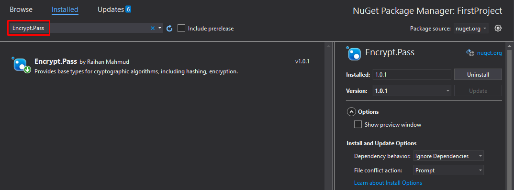
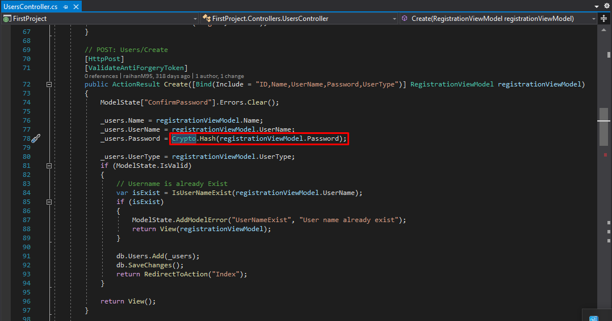
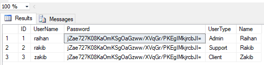

# Encrypt.Pass

   
  
  
  
  

## Objectives
Provides base types for cryptographic algorithms, including hashing, encryption.

## Instructions

+ **Installation**
    * Go to Solution » Manage NuGet Packages » Browse Encrypt.Pass
    * Install Encrypt.Pass
    
    
    
+ **Configuration**
    * Passing password value for hashing
    
    

+ **Result**
    * Go to Database
    
    
